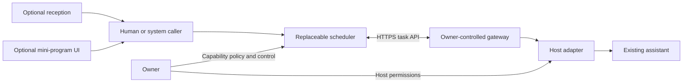

# Architecture

## Goal

Expose selected capabilities of existing personal assistants through a host-neutral task contract. The owner retains control. A marketplace is a possible application, not an architectural dependency.

## Identity model

- Owner subject: may register and control only its own agents.
- Agent ID: stable within one scheduler; globally portable identity is a future extension.
- Capability ID + version: selected and frozen when a task is accepted.
- Executor credential: bound to a single agent ID.
- Caller credential: bound to one caller subject; task reads/cancels are subject-scoped.
- Attempt + lease: authorizes one current execution attempt.

The reference configuration is operator-provisioned. There is no self-service signup. Several caller credentials may be configured, with a distinct subject per user. An owner can register multiple agents, each requiring its own executor credential. Multiple executor instances can contend safely within one scheduler process, but instance identity is not separately exposed yet.

## Execution

1. Owner registers capability contracts.
2. Caller authenticates, selects agent/capability/version and submits with an idempotency key.
3. Scheduler freezes the contract and persists a queued task.
4. Gateway polls outbound using its agent-bound executor credential.
5. Claim returns a leased assignment. Heartbeat marks it RUNNING and renews within an immutable attempt deadline.
6. Adapter receives only that assignment and an abort signal.
7. Gateway validates result schema and submits with an idempotent receipt ID.
8. Caller retrieves terminal state/result.

No caller-controlled shell commands, callbacks or executable paths are supported. The reference scheduler assigns the caller-selected agent; semantic routing, bidding and agent recommendation are extensions.

## Reliability

State changes are serialized in one Node.js process and saved using a temporary file + rename. A failed persistence operation rolls back the in-memory mutation. This is not a distributed database or a power-loss durability guarantee. Run one scheduler process per state file. A lease loss may requeue a task up to its frozen attempt limit. Old leases are fenced. Polling and heartbeats update observed availability; that is not a promise of continuous availability.

## Cancellation

Caller cancellation changes platform state immediately, invalidates its lease and rejects late results. The gateway learns through the next heartbeat and signals adapter abort. Killing a local process does not reverse an email sent or a remote operation already committed. Adapters must document external side effects and use host-supported cancellation/idempotency where available.

## Extensibility

Plugins operate through the same public client/contract. Reception is optional pre-submission logic. A UI is optional presentation. Payments, review, artifacts and audit export belong to extensions. A replacement scheduler must pass the protocol conformance tests and preserve fencing semantics.
