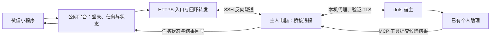

# 真实 dots 案例：通过本机电脑桥接

## 真实链路

**接入小程序时使用了主人电脑，不是服务器直接转发到 GPT 完成执行。** 公网服务器提供稳定 HTTPS 入口、平台业务及数据库；电脑承载桥接进程和访问宿主的网络路径。小程序不直接访问电脑，也不直接持有助理的 OAuth 凭证。

本例使用 SSH 反向隧道让公网入口到达本机回环端口；桥接进程通过另一路本地转发访问平台数据库。数据库端口没有因此公开。具体用户名、IP、密钥路径、端口及宿主标识不随开源发布。

## 为什么采用电脑

当时大陆服务器到宿主回调地址的网络连接失败，本机已有可用网络代理，因此将桥接执行与回调路径移到电脑。这里只记录当次部署事实，不把它概括为所有大陆服务器都无法连接，也不宣称该网络方式具有生产级可用性。

电脑关机、休眠、用户未登录、桥接进程停止、SSH 隧道中断或代理失效，都可能导致任务不能执行。长期授权不等于电脑永远在线。原实现用登录启动及进程重启提高可用性，但尚未完成长期宿主续期与持续在线的完整观测。

## 连接和执行机制

1. 主人绑定执行端身份，通过一次性配对码完成 OAuth 授权。
2. 插件暴露领取、读取、提交、失败及状态查询工具。
3. 有新任务时，桥接通知宿主；只有宿主实际唤醒并调用工具才能算自动执行通过。
4. 助理获得 taskId、attemptId、leaseId，只读取任务正文。
5. 候选结果回到桥接服务，审核后交给标准平台任务流程。
6. 权限、状态和尝试版本检查阻止重复执行和旧结果覆盖。

原实现包含长期授权、刷新凭据轮换、事件订阅及撤销。通用项目目前采用静态角色令牌，尚未移植这套 OAuth。两者状态必须分别描述。

## 控制语义

- 临时关闭：停止本机链路与自动启动，保留原授权；恢复后重新连接。
- 永久关闭：撤销授权和订阅，停止本机链路；再次接入需要明确授权。

通用项目的 pause 是服务器停止接纳和领取新任务，当前任务可完成；这与原案例“停止整个本机链路”的实现不同，不能混用指令。

## 验证范围

真实场景由维护者验证并确认；以下不是本仓库自动化测试的宿主认证结果。

| 场景 | 原案例状态 |
|---|---|
| 真实 OAuth 连接 | 已验证 |
| 真实领取、读取、回写 | 已验证，使用合成公开材料 |
| 本机代理 TLS 与事件订阅 | 已验证 |
| 事件唤醒已有助理并实际提交 | 已验证 |
| 标准 Agent 握手与测试执行 | 已验证 |
| 小程序适配 | 已接入并有真实付费任务记录 |
| 真正支付到最终小程序交付 | 真实付费到记录的完整闭环已验证，包含需求确认、执行、成果交付、用户验收与史官记录 |
| 插件调用时的上下文 | 前端不显示，但底层上下文实际存在 |
| 多租户私人上下文和工具隔离 | 当前无法建立可验证的租户隔离或独立上下文 |
| 长期宿主续期和高可用 | 未完成持续观测 |

上述验证来自原案例的历史脱敏摘要，不是本仓库 CI 对真实宿主重新执行的结果。

## 公开的实现

参见 [dots 参考源码](../examples/dots-adapter/README.md)。源文件保留关键流程，但依赖原平台接口，并非可一键运行的通用 dots 适配器。独立可运行演示从仓库根目录启动，无需原平台账号。许可与逐文件归属检查见 [审查记录](license-review.md)，维护者已确认该快照的 MIT 发布授权。

## 付费验收与上下文边界更正

维护者已确认微信小程序调用 dots 完成真实付费、需求确认、执行、成果交付、用户验收到记录的全过程。因此撤销“完整付费交付待验收”的旧表述。公开说明不包含订单、任务、用户、交易标识或具体订单金额。

该链路包含故障恢复及成果导入修复，不宣称首次执行即成功，也不等于最终资金结算或多租户隔离。插件在前端不显示上下文，但实际上下文仍存在。当前没有可验证的独立上下文或租户隔离，需 dots 宿主提供相应边界和受支持接口；外部桥接不能仅靠提示词或任务编号保证隔离。
